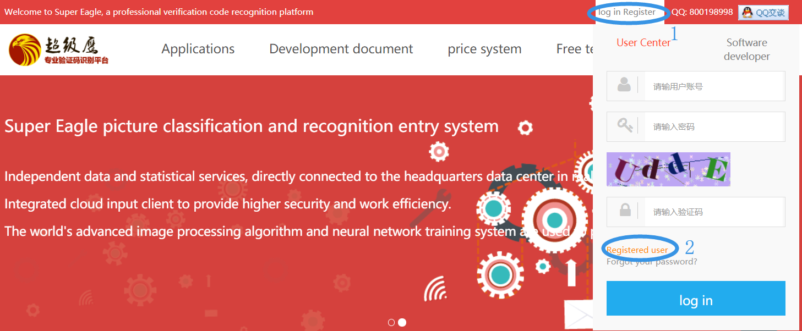
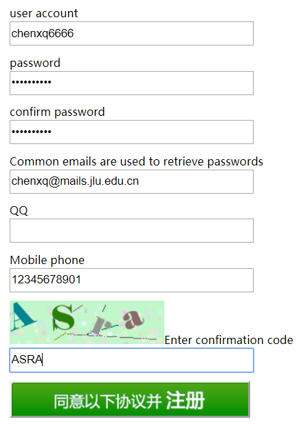
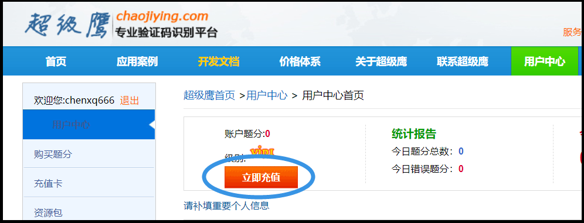
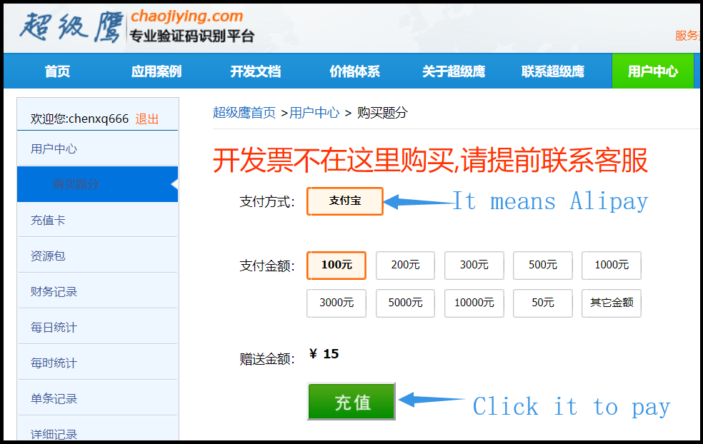

1. The captcha identification is implemented by using a commercial system named [chaojiying](http://www.chaojiying.com/). So we should first register an account. There is only Chinese website for this system. Fortunately, it can be translated to English in Chrome. Click the following two buttons to create an account.



2. Enter the following items. QQ is not needed. Click the bottom green button to finish the registration.
  
3. Click the following red button to pay some money. **<u>Please note that only Alipay and Chinese RMB is accepted</u>**. 




4. Modify`line 205` of `scihub.py`. Fill in the UserName and Password. For example:

```python
chaojy = chaojiying.Chaojiying_Client('chenxq6666', 'qwertyuiop', '')
```

5. Paste your DOIs at the end of `scihub.py`. Then run it.

6. Other options.

- In `line 204` of `scihub.py`, "10" means the program try up to 10 times to recognize the captcha.

```python
for i in range(10):
```

- In `line 209` of `scihub.py`, "3008" means the captcha only contains 1~8 English letters. According to my test, "3008" is best to recognize the captcha of SciHub.

```python
temp_dict = chaojy.PostPic(im, 3008) 
```

